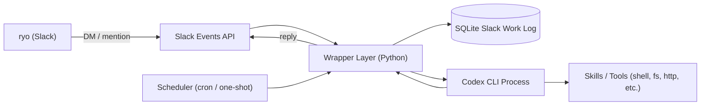

# Design Doc: 自分用パーソナルエージェント

## 1. 概要

Codex CLIをコアの推論／実行エンジンとしてラップし、Slackから自然言語で指示できる個人専用のパーソナルエージェントを構築する。Raspberry Pi上にsystemd serviceとして常駐させ、対話・スケジュール起動・workspace上の長期記憶の3軸でユーザーの作業を伴走することを目的とする。

## 2. 目的とゴール

- Slack上でテキストを送るだけで、Codex CLIの能力（コード実行、ファイル操作、外部API呼び出しなど）を呼び出せる状態を作る。
- cron的なスケジュール起動と、Slack経由のadhoc起動の両方をサポートする。
- `.env` で有効化した場合、Botがデフォルト機能として1日4回程度ランダムな時刻にSlackへ自発発話する。
- Slackスレッド単位の作業ログをSQLiteに永続化し、セッションを跨いだ会話継続と実行履歴の追跡を行う。
- 破壊的操作（削除系）のみ人間の確認を挟み、それ以外は原則として自律実行する。
- 人格や行動規約は `workspace/AGENTS.md` としてリポジトリ内に集約し、変更履歴を追える形で管理する。

## 3. 非ゴール

- マルチユーザー対応（当面は自分1人専用）。
- 複数LLMプロバイダ／ローカルLLMへの抽象化（Codex CLIに固定）。
- リッチなWeb UI（操作面はSlackとCLIに限定）。

## 4. アーキテクチャ概要

## 5. コンポーネント

### 5.1 Wrapper Layer

- 役割: Slackイベント受信、スケジューラ起動、Codex CLIの子プロセス管理、メモリ読み書き、確認フロー制御。
- 実装言語: Python。パッケージ管理と仮想環境は `uv` に統一し、`.env` は `python-dotenv` で読み込む。
- 主なモジュール
  - slack_gateway: Slack Events API (Socket Mode)から入力を受け、出力を整形して返す。
  - session_manager: Slackスレッド（slack_thread_ts）単位でCodex CLIのセッション（rollout）を1対1に対応付ける。スレッド初回はcodexを新規起動し、以降は `codex resume <rollout_id>` で再開する。コンテキスト消費が閾値を超えた場合は、要約を生成したうえで新しいrolloutへロールオーバーする。
  - codex_runner: Codex CLIをサブプロセスとして起動し、stdin/stdoutでやりとりする。新規セッションと `codex resume` を呼び分け、既定ではリポジトリ直下の `workspace/` を作業ディレクトリとして実行する。一定時間アイドルになったらプロセスを終了してメモリリークの蓄積を抑える。
  - approval_guard: 削除系コマンドを検出した際にSlackで確認ボタンを出して承認を待つ。
  - memory_store: SQLiteにSlackスレッド由来の会話ログ、CodexセッションID、スケジュール実行メタデータを保存／検索する。
  - scheduler: 定期実行ジョブを管理し、Wrapperにイベントを流す。
  - proactive: `.env` の `PROACTIVE_*` 設定に基づき、デフォルト自発発話のone-shotタスクを日次で自動生成する。

### 5.2 Codex CLI 層

- `workspace/AGENTS.md` に人格、口調、安全規約、よく使うショートカットを記述する。
- Codex CLIの作業ディレクトリは `workspace/` に切り出し、Wrapper本体・設計文書・タスク管理ファイルへの意図しない変更を避ける。運用時に別ディレクトリへ分離したい場合は `CODEX_WORKSPACE_DIR` で上書きする。Codexにworkspace内の書き込みを許可する場合は `CODEX_SANDBOX=workspace-write` を明示する。
- Skillsは `workspace/skills/` ディレクトリに配置し、Codex CLIから呼び出せる形にしておく。一覧とトリガーフレーズは `workspace/skills/README.md` で管理する。
- Codexがセッション開始時に読む補助記憶として `workspace/MEMORY.md` と `workspace/diary/yyyymmdd.md` を用意する。エージェントの人格、行動規約、長期記憶、日記、スキルは `workspace/` に集約し、SQLiteはSlackの作業ログとWrapperの復元用メタデータに限定する。
- 「スキルを作るスキル」をひとつ用意し、新しいskillの雛形生成・登録までを自動化する。

### 5.3 Slack作業ログ層 (SQLite)

SQLiteはSlackから発生した作業ログを残す場所と位置づける。人格、口調、好み、恒久ルール、日記、スキルなどエージェント自身にまつわる情報は `workspace/` 配下のMarkdownとskillファイルで管理する。`preferences` テーブルと `audit_logs` テーブルは廃止し、新規作成しない。

概略スキーマ:

| テーブル | 主なカラム | 用途 |
| --- | --- | --- |
| conversations | id, slack_thread_ts, codex_rollout_id, parent_conversation_id, started_at, summary, token_usage_estimate, last_active_at | Slackスレッド単位の会話メタデータ。1スレッド＝1 conversationを基本とし、ロールオーバー時は新しいレコードを作成してparent_conversation_idで連結する |
| messages | id, conversation_id, role, content, created_at | 会話ログ |
| tasks | id, title, prompt, schedule_cron, run_at, last_run_at, status, notify_channel, source_key | Slackから登録された定期タスク／予約タスクの復元用メタデータ |

Slackスレッドの継続に必要な要約は、conversationsテーブルのsummaryカラムにCodex CLI自身が定期的に圧縮して書き戻す方式とする。要約トリガは以下を併用する。

- トークン使用量ベース: rolloutのコンテキスト消費が60%を超えたら自動要約し、新しいrolloutへロールオーバーする。要約は新rolloutの冒頭にシステムメッセージとして注入する。
- アイドル時間ベース: スレッド最終発言から24時間無発言が続いた場合に自動要約し、スレッド再開用の作業ログ要約として固定化する。
- 明示要求ベース: ユーザーが「ここまでをまとめて」と指示した場合、その時点でスナップショット要約を作成する。

スレッド横断の長期記憶（口調・好み・恒久ルール）はSQLiteへ保存せず、`workspace/MEMORY.md`、`workspace/diary/`、`workspace/AGENTS.md` に反映する。新規rolloutの起動時はworkspaceを作業ディレクトリにすることで、Codex側がこれらの可読コンテキストを参照できる状態にする。

### 5.4 Scheduler

- xangiのスケジューリング実装を参考にしつつ、cron式とone-shot実行の両方を扱う。
- Wrapperプロセス内のジョブキューとして動かし、起動時にtasksテーブルから登録済みジョブを復元する。
- 実行結果はSlackの所定チャンネル（例: #agent-log）に通知する。
- デフォルト自発発話は `source_key=proactive:YYYY-MM-DD:n` のone-shotタスクとして保存し、通常のユーザー登録タスクと同じ復元経路に乗せる。投稿形式はScheduled Task見出しを付けず、Codexが生成した自然文だけを送る。
- 既存cronタスクの時刻変更は、Slackの自然文または `schedule update <task_id> | <m h * * d>` からWrapperが解釈し、SQLiteの `tasks.schedule_cron` を直接更新する。cron設定はSQLiteを唯一の正とし、`workspace/` には複製しない。更新後はSchedulerの既存handleを解除し、新しいcronで再登録する。
- 既存タスクの削除は、Slackの自然文または `schedule delete <task_id>` からWrapperが対象を特定し、確認メッセージを返す。ユーザーが同じSlack会話で `schedule delete confirm <task_id>` または自然文の肯定応答を送った場合のみ `tasks.status=cancelled` に更新し、Schedulerのhandleを解除する。監査性と復旧容易性のため物理DELETEは行わない。
- **更新 (2026-05-10)**: ユーザー入力はルールベースの固定コマンドだけでなく、自然文（例:「毎朝9時に実行して」）からも登録できるようにする。
  - `schedule_intent_parser` を追加し、LLMで「時点指定（cron/one-shot）」と「実行タスク本文」を抽出する。
  - 抽出結果は構造化JSON（kind/title/prompt/scheduleCron/runAt/confidence）で受け取り、confidence閾値未満は通常会話として扱う。
  - タイムゾーン解釈は原則UTC保存とし、将来的にユーザーごとのtimezone preferenceを適用する。
  - **更新 (2026-05-12)**: 保存はUTCのまま維持し、ユーザーへの登録完了メッセージではJSTへ変換して表示する。

### 5.5 Slack 連携

- Socket Modeでアウトバウンド接続のみとし、Raspberry Pi側のポート開放を不要にする。
- DMとメンションをトリガとして受け付ける。
- 削除系の確認はinteractive message (Block Kit) のApprove / Denyボタンで行う。
- workspace内の `share/` 配下にあるファイルをSlackへアップロードできる。送信はWrapper側がSlack Bot Tokenを保持したまま `files_upload_v2` で実行し、Codex CLIへSlack tokenを渡さない。
- ユーザーの自然文（例: `report.mdを送って`）と、Codex応答末尾の `ROBOPEN_FILE_UPLOAD {"path":"report.md","comment":"..."}` マニフェストを送信トリガとして扱う。送信対象は `SLACK_FILE_ROOT` 配下の相対パスに限定し、root外参照、隠しファイル、ディレクトリ、サイズ超過は拒否する。

## 6. 主要フロー

### 6.1 Slack経由のadhocリクエスト

1. ユーザーがSlackでメンションまたはDMを送る。
2. slack_gatewayがイベントを受信し、session_managerに渡す。
3. session_managerはslack_thread_tsに紐づくconversationsレコードを参照し、codex_rollout_idがあれば `codex resume <rollout_id>` で再開、なければ新規にcodexセッションを起動する。最新のスレッド要約を冒頭のコンテキストとして渡し、エージェント設定や長期記憶は `workspace/` から参照させる。
4. codex_runnerがCodex CLIにユーザーメッセージを渡し、ストリーミング出力をSlackに返す。完了時にrollout_idとトークン使用量をconversationsへ書き戻し、コンテキスト消費が閾値を超えていれば次回以降のロールオーバーをスケジュールする。
5. 出力中に削除系コマンド（rm, DROP, deleteなど）を検出した場合、approval_guardが介入してユーザーに確認する。
6. 完了後、Slackへ返した内容と主要な実行結果をmessagesへ保存する。承認イベントはSlackスレッド上の通知として残し、専用のaudit_logsテーブルは持たない。

### 6.2 スケジュール起動

1. schedulerがtasksの実行時刻を検知する。
2. Wrapperが対応するプロンプトを組み立て、Codex CLIに投げる。
3. 結果をSlackの通知チャンネルに送り、必要ならフォローアップスレッドを開く。
4. Slack投稿に成功して投稿 `ts` が得られた場合は、`channel:ts` を `slack_thread_ts` として `conversations` に登録し、投稿本文を `assistant` メッセージとして保存する。これにより、ユーザーがその投稿のスレッドで返信した場合は同じCodexセッションとして会話を継続する。

### 6.3 デフォルト自発発話

1. 起動時に `PROACTIVE_ENABLED=true` かつ投稿先チャンネルが設定されているか確認する。
2. JSTなど `PROACTIVE_TIMEZONE` 基準で、`PROACTIVE_WINDOW_START` から `PROACTIVE_WINDOW_END` の間に1日4回程度のone-shotタスクを作成する。
3. 各タスクの実行時、Codex CLIに短い状況確認・作業再開・休憩・予定確認の発話文を生成させる。
4. 生成に成功した場合は `PROACTIVE_CHANNEL` または `SLACK_LOG_CHANNEL` へ自然文のみ投稿する。失敗した場合はSlack投稿せず、journaldに `[proactive]` prefixで記録する。
5. Slack投稿に成功して投稿 `ts` が得られた場合は、`channel:ts` を `slack_thread_ts` として `conversations` に登録し、自然文の投稿本文を `assistant` メッセージとして保存する。ユーザーがその投稿のスレッドで返信した場合は同じCodexセッションとして会話を継続する。
6. 実行済みタスクは `done` にし、翌日分の不足タスクを補充する。

### 6.4 スキル追加

1. ユーザーが「新しいskillを作って」と依頼する。
2. Codex CLIが `workspace/skills/skill-creator/SKILL.md` を読み、`workspace/skills/` 配下にテンプレートを生成する。
3. `workspace/skills/README.md` にskillの説明とトリガーフレーズを追記し、コミットする。

### 6.5 workspaceファイルのSlack送信

1. Codex CLIまたはユーザーが `workspace/share/` 配下に送信対象ファイルを用意する。
2. ユーザーが自然文または `file send <relative_path>` で送信を依頼する。Codexが送信を提案する場合は、応答末尾に `ROBOPEN_FILE_UPLOAD` マニフェストを出力する。
3. Wrapperが送信対象を `SLACK_FILE_ROOT` 配下の相対パスとして解決し、パストラバーサル、root外symlink、隠しファイル、ディレクトリ、サイズ上限を検証する。
4. 検証に通った場合のみ、WrapperがSlack SDKの `files_upload_v2` で現在のチャンネルまたはスレッドへアップロードする。
5. 成功時はSQLiteのmessagesへ `[file_uploaded] <relative_path>` を保存し、Slackからfile id/permalinkが得られた場合は同じログ本文へ含める。

### 6.6 Slack添付ファイルの受信

1. ユーザーがDMまたは追跡済みスレッドにファイルを添付すると、Wrapperは `file_share` subtypeのメッセージも会話入力として扱う。
2. WrapperはSlack file objectの `url_private_download` または `url_private` をBot Tokenで取得し、`SLACK_INBOUND_FILE_ROOT` 未設定時は `CODEX_WORKSPACE_DIR/inbox/slack/yyyymmdd/` 配下へ保存する。
3. ファイル名はSlack file idと安全化した元ファイル名から生成し、パストラバーサルや上書きを避ける。
4. Slack側の申告サイズと実ダウンロードサイズを `SLACK_INBOUND_FILE_MAX_BYTES`（未設定時20MB）で検証し、超過時はSlackへエラーを返してCodex CLIへ渡さない。
5. Codex CLIへはSlack tokenを渡さず、保存済みファイルのworkspace相対パス、title、mimetype、size、file idを通常プロンプトへ追記する。

## 7. セキュリティと安全策

- 削除系コマンド、外部送金、外部APIの破壊的操作はすべてapproval_guardで確認を取る。
- 承認待ちのアクションはタイムアウト（例: 10分）で自動キャンセルする。
- Raspberry PiへのSSHは公開鍵のみ、Slack Bot Tokenとシークレットは `.env` で管理し、リポジトリには含めない。systemdからは `EnvironmentFile=/home/<user>/robopen-agent-py/.env` で読み込む。
- 承認対象の操作はSlackスレッド上に要求・承認・拒否・タイムアウトを投稿し、そのSlack作業ログをSQLiteのmessagesへ保存する。SQLiteに専用audit_logsテーブルは持たない。
- Codex CLIの5時間ローリング上限と週次クォータを `/status` 相当の手段で定期取得し、残量が閾値（例: 残10%）を割ったらスケジュール起動タスクを自動でスキップ・先延ばしする。
- robopen-agentおよびcodex関連プロセスはsystemdの `Restart=always` で異常終了時に自動復旧する。必要に応じて `MemoryMax` / `MemoryHigh` と日次の定期再起動を追加し、長時間稼働によるメモリリーク蓄積を抑える。

## 8. デプロイ

- Raspberry Piにリポジトリを配置し、`uv sync` で依存関係を同期する。
- 標準起動コマンドは `uv run robopen-agent` とする。`uv run python -m robopen_agent` は代替起動手段として扱う。
- 本番運用では `robopen-agent.service` をsystemdに登録し、SSH切断後も常駐させる。Raspberry Pi再起動後は `systemctl enable` により自動起動する。
- systemd unitは `EnvironmentFile` で `.env` を読み込み、Slack token、`CODEX_CMD`、`CODEX_WORKSPACE_DIR`、`CODEX_SANDBOX`、`SQLITE_PATH`、`SLACK_LOG_CHANNEL` を注入する。
- ログはjournaldで確認する。標準の確認コマンドは `journalctl -u robopen-agent -f` とする。
- SQLiteは `data/agent.db` を標準配置とし、日次バックアップと復元手順を運用ドキュメントで管理する。
- コンテナ運用は当面の標準運用から外し、必要になった場合の将来検討扱いにする。

## 9. 段階的マイルストン

| フェーズ | スコープ | 完了条件 |
| --- | --- | --- |
| M0 PoC | ローカルでSlack DMからCodex CLIを叩いて返す | 1往復の対話が成立する |
| M1 永続化 | SQLiteにSlack作業ログを保存し、スレッド単位で文脈を維持 | 過去のSlack発言と作業結果を参照した応答ができる |
| M2 スケジューラ | cron式タスクの登録・実行・通知 | 毎朝の要約タスクが自動投稿される |
| M3 確認フロー | 削除系コマンドのapproval_guardを組み込む | rm系操作で必ず確認が走る |
| M4 Raspberry Pi常駐 | Raspberry Piにsystemd serviceとして本番デプロイ | SSH切断後・再起動後も常駐し、ログ監視ができる |
| M5 スキル拡張 | 「スキルを作るスキル」と最初の実用skill 2〜3本 | 会話からskillが追加できる |

## 10. 未決事項

- 起動オーバーヘッド（初期化トークン消費とレイテンシ）の実測値が想定より大きかった場合、`codex mcp-server` モードへ常駐させる構成へ移行するかの判断基準。最初の1週間で「初期化トークン量」「平均応答レイテンシ」「1日あたり総トークン消費」の3指標を計測したうえで判断する。
- 要約ロールオーバーの閾値（暫定60%）と、要約プロンプトのフォーマットの最適化。要約品質はスレッド再開時の応答整合性で評価する。
- ロールオーバー後の旧rolloutのアーカイブ方針（削除するか、検索可能なまま残すか）。
- Slack以外の入口（Notionコメントやメール）を将来的に増やすかどうか。
- ai-assistant-workspaceの人格テンプレートを参考にしつつ、robopen向けの `workspace/AGENTS.md` として独自設計する。

## 11. 参考

- xangi: Slack疎通とスケジューリングの実装を参照。
- ai-assistant-workspace: 人格設計とメモリ戦略、スキル生成の考え方を参照。
